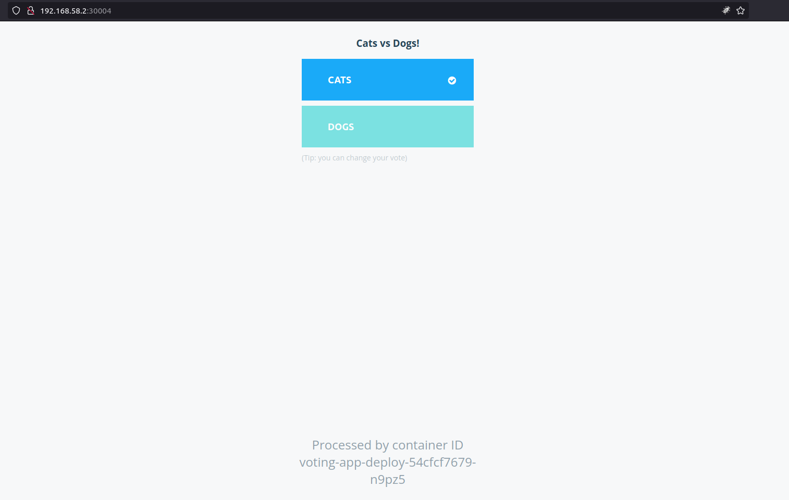
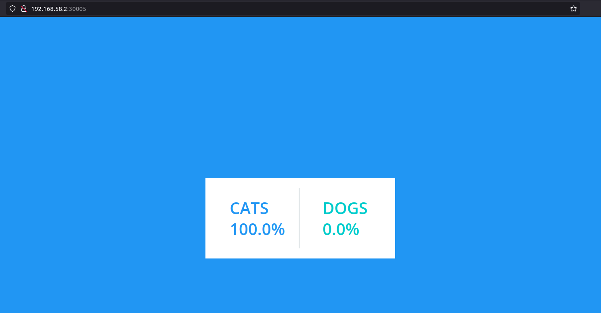

# Voting App Implmentation with Kubernetes

Voting app implementing with kubernetes is based on course udemy from mumshad, from this [origin repo](https://github.com/kodekloudhub/example-voting-app-kubernetes). then I specified with each folder/directory. have you enjoy !.

## directory

- deployments
- pods
- service

## Commands

```bash
# running pod with service and deployment
kubectl create -f services/
kubectl create -f deployments/

# output
╰$ kubectl apply -f services
service/redis created
service/db created
service/voting-service created
service/result-service created

╰$ kubectl apply -f deployments
deployment.apps/postgres-deploy created
deployment.apps/redis-deploy created
deployment.apps/result-app-deploy created
deployment.apps/voting-app-deploy created
deployment.apps/worker-deploy created


# get the access url
╰$ minikube service result-service --url
http://192.168.58.2:30005

╰$ minikube service voting-service --url
http://192.168.58.2:30004


# running manually with pod
kubectl create -f services/
kubectl create -f pods/

```

## Output

1. voting-app page
   
2. result-app page
   

## Reference

- [mumshad-votingapp](https://github.com/kodekloudhub/example-voting-app-kubernetes)
